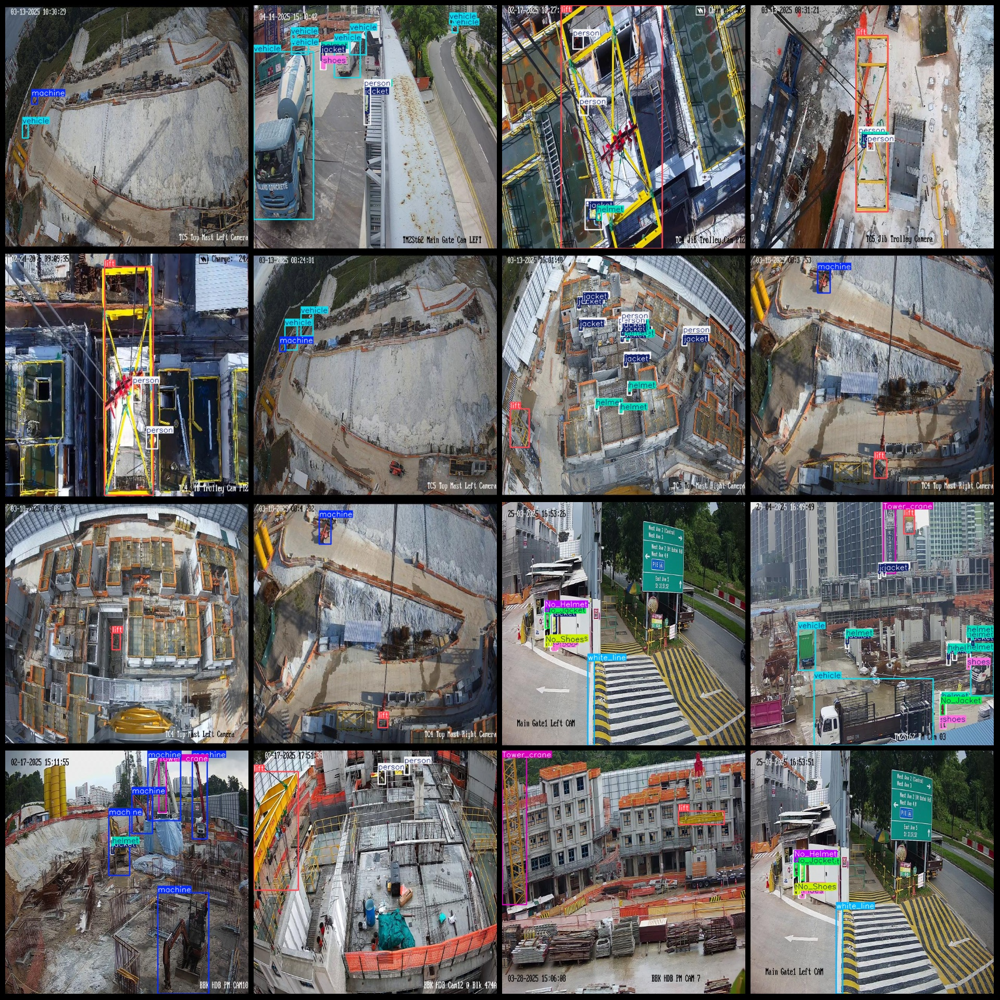
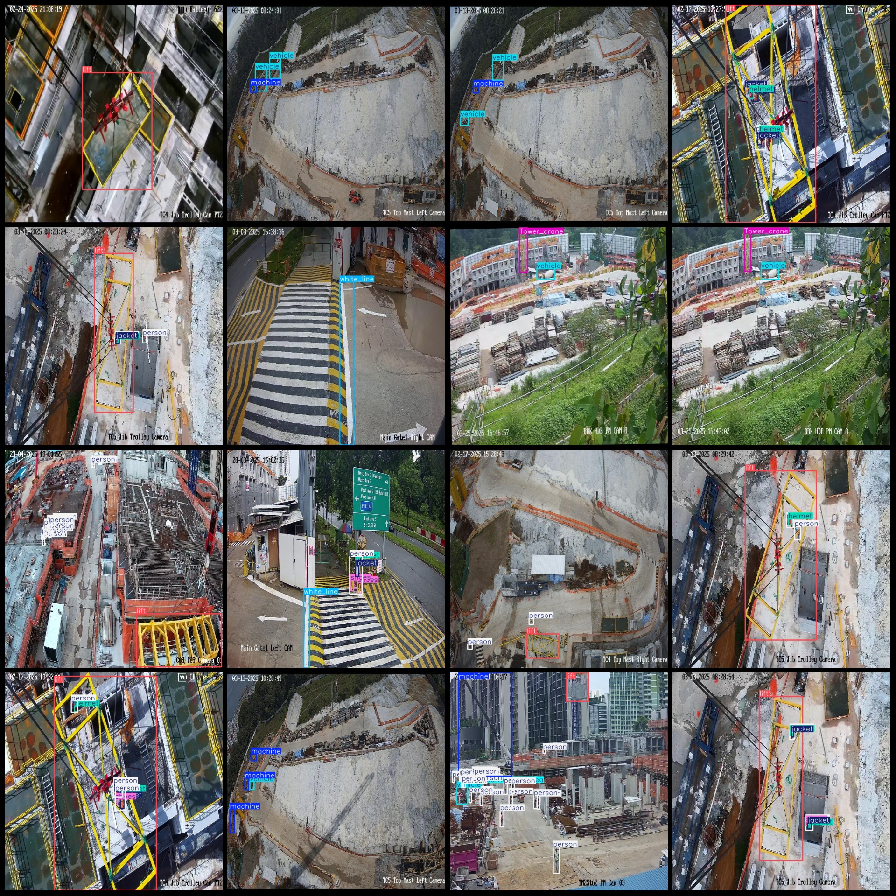

# Smart Construction Safety Detection Data Set in VOC+YOLO format with 4397 images and 15 categories

Please note that approximately 3500 images in the dataset are original images (snapshots from videos), while the remaining are generated through rotation enhancement.
Dataset format: Pascal VOC format + YOLO format (txt file without split path, only contains jpg images and corresponding VOC format xml files and yolo format txt files)
number of images: 4397  
annotation count: 4397  
annotation count: 4397  
annotationnumber of classes: 15  
Annotation class names: ["Main_gate", "No_Helmet", "No_Jacket", "No_Shoes", "Tower_crane", "helmet", "jacket", "lift", "machine", "mapping_zone", "person", "shoes", "unbarricaded_area", "vehicle", "white_line"]
boxes per class:   
Main_gate: 50 boxes, images: 49
No_Helmet: 2775 boxes, images: 555
Number of No_Jacket (No Safety Vest) frame = 2389, Number of Images occupied = 591
The number of frames labeled "No Shoes" is 519, and the number of images associated with this label is 185.
Number of frames in Tower Crane = 1000, number of pictures owned = 647
Number of helmet (safety hat) frames = 5468, Number of images occupied by helmet (safety hat) = 2085
Number of jackets (safe vests) = 4456, Number of images occupied by jackets = 1619
Construction elevator box count = 2323, images = 2240
Machinery box count = 1670, images = 1126
Mapping zone box count = 5, images = 5
Person box count = 11401, images = 2925
Shoes box count = 2755, images = 1143
Unbarricaded area box count = 145, images = 145
Vehicle box count = 3398, images = 1628
White line box count = 476, images = 426
total boxes: 38830  
image resolution: 640x640  
Using an annotation tool: labelImg
Annotation rules: Draw a rectangle around the class.
Important notes: Dataset does not have separate training, validation, and test sets to be divided.
Special statement: This dataset does not guarantee the accuracy of the trained model or weight files.
Image preview:
## Images

Here is a pay link on Stripe ( https://buy.stripe.com/3cs8yP7sY87d0vu9AB ). Please contact me lonlonago@foxmail.com after funding $89, and I will send you a complete data files , thank you!

